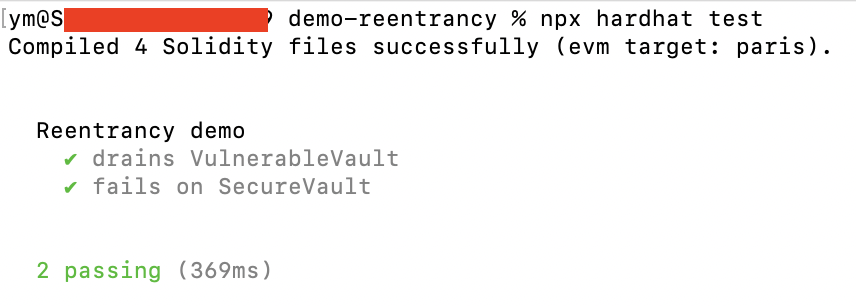

# Demo reentrancy

Minimal Hardhat project demonstrating how OpenZeppelin's **ReentrancyGuard** stops the classic drain-the-vault exploit.

## Quick start

```bash
npm install
npx hardhat test
```

Expected output:


## Contracts

* `SecureVault.sol` – safe implementation with `nonReentrant`
* `VulnerableVault.sol` – intentionally unsafe for demo
* `Attack.sol` – malicious contract that exploits the unsafe vault

Tests in `test/vault.js` run the attack against both vaults.
